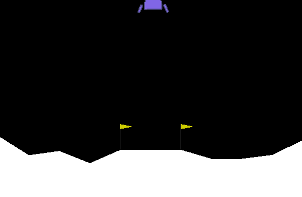
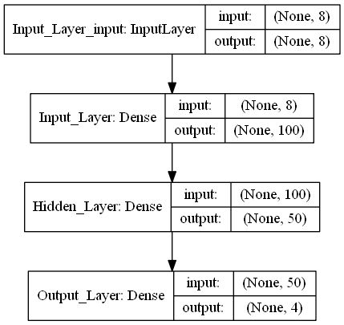
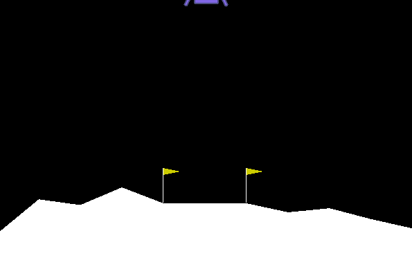
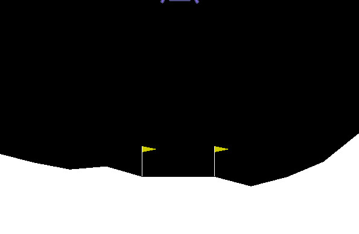
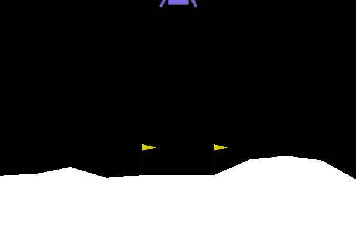
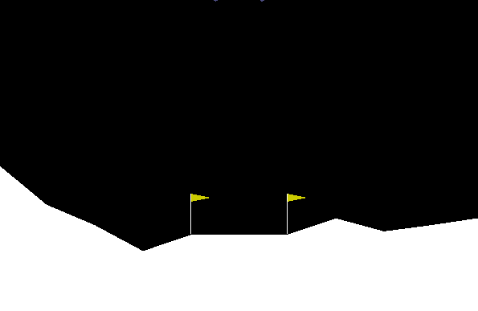
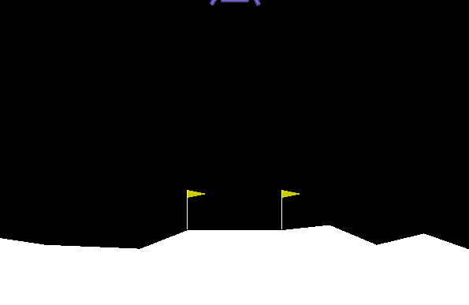

# Safe Landings In Deep Space

### Disclaimer
This project was conducted for University of Toronto - School of Continuing Studies (SCS) as part of the Intelligent Agents & Reinforcement Learning - 3547 Course.

Submitted By:
- Adnan Lanewala
- Nareshkumar Patel
- Nisarg Patel

## Introduction
### Background
Rocket trajectory optimization is a classic topic in Optimal Control.  
According to Pontryagin's maximum principle it's optimal to fire engine full throttle or turn it off. That's the reason this environment is OK to have discreet actions (engine on or off).  
Landing pad is always at coordinates (0,0). Coordinates are the first two numbers in state vector. Reward for moving from the top of the screen to landing pad and zero speed is about 100..140 points. If lander moves away from landing pad it loses reward back. Episode finishes if the lander crashes or comes to rest, receiving additional -100 or +100 points. Each leg ground contact is +10. Firing main engine is -0.3 points each frame. Firing side engine is -0.03 points each frame. Solved is 200 points. Landing outside landing pad is possible. Fuel is infinite, so an agent can learn to fly and then land on its first attempt. Four discrete actions available: do nothing, fire left orientation engine, fire main engine, fire right orientation engine.  

### Goal
Navigate a lander to its landing pad safely and have a safe touch down. A sample of heuristic landing is shown below.  

# Our Approach
## Algorithm
We used the Q-Learning Algorithm with a Deep Neural Network developed in Keras library. This algorithm is also known as the DQN algorithm. For more information on the algorithm please check out the paper *[Playing Atari with Deep Reinforcement Learning](https://arxiv.org/pdf/1312.5602.pdf)* 

## Keras Model
We utilized the keras library to create a neural network that has state space as the input layer and output layer is the actions recommended by the agent. The input layer has 8 nodes, then there is a hidden layer with 100 nodes and another hidden layer with 50 nodes. All hidden layers use the `relu` activation function. The output layer is a linear activation function with 4 nodes representing 4 discrete actions.  

## Agent Learning History 

 
**EPISODE = 10**  
 
**EPISODE = 50**  
 
**EPISODE = 100**  
 
**EPISODE = 150**  
 
**EPISODE = 200**  

## Agent Testing

## Setup
Libraries Used:
- `Open AI Gym` (v0.15.4) - https://github.com/openai/gym
- `Open AI Box2D-py` (v2.3.8) (Comes with gym) - https://github.com/openai/box2d-py
- `Keras` (v2.2.5) - https://pypi.org/project/Keras/

Anaconda Packages:
- `Swig` (v3.0.12) (Anaconda Package) - https://anaconda.org/anaconda/swig
- `pystan` (v2.19.1.1) (Anaconda Package) - https://anaconda.org/conda-forge/pystan
- `pyglet` (v1.4.8) (Anaconda Package) - https://anaconda.org/conda-forge/pyglet
 
Note: If you see errors during installation in regards to `Mujoco.py` kindly ignore it as we will not be using the `MUJOCO` environment. If you are windows user please check out the Windows Instructions to make sure you have the necessary setup before installing any of the above libraries as you may run into errors.

### Windows Instructions
Install & Setup SWIG
***
1. Go to http://www.swig.org/download.html to get the latest version of the `SWIG` library or go to https://sourceforge.net/projects/swig/files/swigwin/swigwin-4.0.1/swigwin-4.0.1.zip/download?use_mirror=iweb to download v4.0.1 directly.
2. Make sure to download `swigwin-x.x.x` for windows as indicated by the `win` in the file name. Please note `x` indicates the version number.
3. Open & Extract the `swigwin-4.0.1.zip` folder.
4. Then go to the extracted `swigwin-4.0.1` folder.
5. Make sure there is `swig.exe` file inside the `swigwin-4.0.1` folder.
6. Copy the entire `swigwin-4.0.1` folder inside the `C:\` drive.
 

Install & Setup Microsoft Visual C++ Build Tools for Visual Studio 2019
***
1. Go to https://visualstudio.microsoft.com/downloads/
2. Scroll down to the bottom of the page and click on `Tools for Visual Studio 2019`.
3. Then browse to `Build Tools for Visual Studio 2019` and click on the Download button to download the file.
4. Once you've downloaded it, run the executable file to begin the installation.
5. Once the application opens up, click on the `Workloads` tab.
6. Select the `C++ build tools` by clicking on the checkbox and begin the installation.
 

Setup Windows Environment Variable
***
1. Open the Windows Environment Variable setting window by running the following command in Run Window `rundll32 sysdm.cpl,EditEnvironmentVariables`. Alternatively it can be opened by going to`Start` -> Right Click on `My Computer` -> Select `Properties` -> Click on `Advanced system settings` -> Click on `Advanced` tab -> Click on `Environment Variables` button.
2. In a new window go to `C:\Program Files (x86)\Windows Kits\10\Include`, then open the folder it maybe similar to `10.0.18362.0`. Underneath that folder, open `ucrt`. Your Path in the Explorer should be similar to `C:\Program Files (x86)\Windows Kits\10\Include\10.0.18362.0\ucrt`. Copy the path to the `ucrt` folder.
3. Under the `Environment Varialbes` window. Underneath `User variables for Admin` select `Path` and click on the `Edit` button. Note if the `Path` variable doesnt exist in the `User variables for Admin`, then create it by clicking on `New` button.
4. Browse to the end of `Variable value` and ensure there is a `;` present, if not add it by typing `;` key on the keyboard. Paste the path that was copied to the `ucrt` folder. In other words paste `C:\Program Files (x86)\Windows Kits\10\Include\10.0.18362.0\ucrt` and add `;` to indicate the end of the entry.
3. Add this`C:\swigwin-4.0.1\;` and `C:\Program Files (x86)\Microsoft Visual Studio\2019\BuildTools\VC\Auxiliary\Build;` to the `Variable value` as well.
4. Restart your computer and now you should be ready to install the Open AI Gym as well as other required packages.

## Presentation
- [PDF]()
- [PowerPoint]()
- [YouTube Video]()
